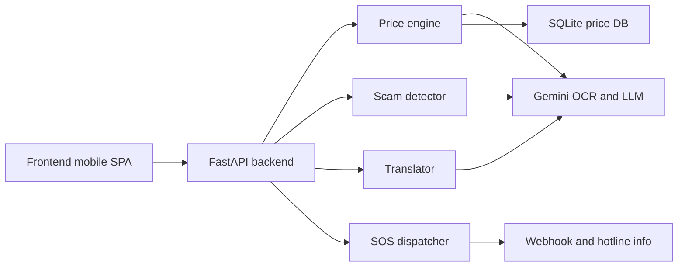
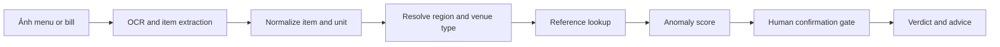

# Đánh giá repo Tour-resQ theo đề bài bảo vệ du khách

Tour-resQ đã có một khung demo khá tốt: frontend mobile-first, backend FastAPI, SQLite, và dùng Gemini cho OCR, phân tích ngữ cảnh, dịch thuật, và SOS. Tuy nhiên, ở trạng thái hiện tại, dự án vẫn chưa đạt mức “implemented end-to-end” cho một số yêu cầu trọng yếu của đề bài, đặc biệt là scam detection thực tế trên frontend, định vị vùng giá đúng theo vị trí, và các import/module bị thiếu có thể làm vỡ app khi chạy. Mức tin cậy của nhận định này là **cao** cho các phần đã kiểm tra trực tiếp từ file repo; **trung bình** với những gì repo tuyên bố nhưng “không tìm thấy” artefact chứng minh tương ứng. citeturn4view0turn5view0turn5view1turn18view0turn19view0

## Kiến trúc hiện tại

Repo đang đi theo mô hình khá rõ: frontend Vanilla HTML/CSS/JS, backend FastAPI, DB SQLite seed sẵn, và nhiều “AI workers” theo module riêng. README mô tả pipeline giá, scam, dịch và SOS; `backend/main.py` mount frontend tĩnh, đăng ký `routes` và `live_negotiation`, còn `price_db.py` tạo các bảng `price_references`, `price_stats`, `scam_reports`, `contribution_logs`. citeturn4view0turn5view0turn19view0



Các module chính hiện thấy trong repo: `frontend/index.html` và `frontend/app.js` cho UI scan/live translate/guardian/SOS; `backend/app/api/routes.py` cho REST endpoints; `backend/app/engine/price_checker.py`, `scam_detector.py`, `translator.py`, `sos_dispatcher.py`, `vision_analyzer.py`, `authority_router.py`; DB nằm ở `backend/app/data/price_db.py`; cấu hình ở `backend/app/core/config.py`. Stack dependency gồm FastAPI, slowapi, httpx, Pillow, Pydantic và `google-generativeai`. citeturn4view0turn21view3turn23view0

## Điểm mạnh rõ ràng

Điểm mạnh nhất là **cách tách lớp logic**: kiểm tra giá bằng thống kê robust trong `check_single_price`, sau đó mới dùng LLM cho phần trích xuất/ngữ cảnh; đây là hướng hợp lý hơn so với để LLM làm “source of truth” toàn bộ. Phần OCR pipeline cũng đã có cấu trúc tương đối đúng: OCR → canonical item lookup → DB check → overall verdict, và còn có cờ `requires_human_confirmation` để giảm báo động giả. citeturn18view0turn19view0

Phần frontend cũng có giá trị demo tốt: camera scan, live translation bằng Web Speech API, SOS slide gesture, hotline, overlay kết quả, và UX định hướng mobile-first. Repo còn có nỗ lực giảm kích thước ảnh bằng canvas JPEG quality 0.6 trước khi gửi backend, có rate limit ở một số endpoint, và có phrasebook offline cho màn “show-to-vendor”. citeturn25view2turn25view7turn30view0turn5view1turn19view2

Một điểm cộng nữa là dự án đã nghĩ đến **liên tục cập nhật dữ liệu giá** qua `add_verified_price` và `add_ambient_price`, thay vì chỉ seed cứng. Điều này rất đúng tinh thần đề bài, dù cơ chế hiện tại còn rủi ro poisoning và gán nhãn sai. citeturn19view0turn24view0

## Vấn đề cần sửa ngay

Các lỗi P0 dưới đây là những điểm tôi sẽ yêu cầu sửa **ngay trước khi demo**.

| Mức | Việc cần sửa | File | Vì sao là P0 |
|---|---|---|---|
| P0 | Thiếu `privacy_scrubber.py` nhưng bị import ở startup path | `backend/app/api/live_negotiation.py`, `backend/main.py` | `main.py` import `live_negotiation`; file này import `app.engine.privacy_scrubber`, nhưng cây `engine/` không có file đó, có thể làm app fail khi start. citeturn5view0turn24view0turn8view0 |
| P0 | Thiếu `delivery_crawler.py` nhưng `price_checker.py` import khi low-data | `backend/app/engine/price_checker.py` | Luồng low-sample sẽ vỡ đúng lúc cần fallback nhất. citeturn18view0turn8view0 |
| P0 | Frontend scam analysis hiện là mock, không gọi backend | `frontend/app.js` | `analyzeScam()` chỉ set text tĩnh; không có call `/api/v1/analyze-situation`. Tính năng (2) về scam detection chưa end-to-end. citeturn27view0turn27view1 |
| P0 | OCR request không gửi `region`, backend default về `hanoi` | `frontend/app.js`, `backend/app/api/routes.py` | Frontend gửi `lat/lng`; backend request model chỉ nhận `image_base64/region/language`, nên kiểm tra giá gần như luôn theo Hà Nội. citeturn30view0turn5view1 |
| P0 | Gửi đóng góp giá hardcode `region: "hanoi"`, `category: "food"`, `venue_type: "street"`, `device_id: "dev123"` | `frontend/app.js` | Làm dữ liệu sai vùng/sai loại, rate-limit giả, và dễ poison DB. citeturn26view0turn26view3 |
| P0 | Nút “DISPATCH REPORT” có trong UI nhưng không tìm thấy handler JS | `frontend/index.html`, `frontend/app.js` | Demo dễ “bấm chết” trên sân khấu. citeturn27view4turn28view2 |

Ngoài ra, luồng privacy đang **mâu thuẫn với claim**. README nói “GPS only on SOS”, nhưng frontend lấy GPS ngay từ onboarding, gọi reverse geocoding với Nominatim, và còn gửi `lat/lng` cùng OCR request; blackbox lại ghi tọa độ vào JSON cục bộ. Claim “privacy/on-device” hiện chưa đứng vững. citeturn4view0turn25view3turn26view4turn30view0turn20view2

## Đánh giá theo từng yêu cầu đề bài

| Yêu cầu | Trạng thái | Bằng chứng | Kết luận mentor |
|---|---|---|---|
| OCR → normalization → reference lookup → anomaly scoring | **Partial** | Có `check_price_from_image`, `search_item`, `check_single_price`, robust Z-score. Nhưng region mapping sai ở frontend. citeturn18view0turn19view0turn30view0 | Backend đúng hướng; cần thêm geospatial region resolver, menu/receipt parser chắc hơn, và test OCR benchmark. |
| Scam detection từ speech | **Partial/Missing end-to-end** | Backend có `detect_scam_patterns` + `detect_scam_with_ai`, nhưng frontend `analyzeScam()` chỉ là UI giả; không gọi endpoint. citeturn22view3turn27view0turn27view1 | Đây là khoảng trống lớn nhất so với brief. |
| Two-way on-the-spot translation | **Partial** | Có `/api/v1/live/*`, buffer transcript, Web Speech API cho vendor/tourist; phrasebook offline có sẵn. Nhưng không có TTS, không có speaker routing thật, không hỗ trợ Russian speech path ở frontend. citeturn24view0turn25view2turn19view2turn26view1 | Demo được, nhưng chưa đủ tin cậy cho hiện trường. |
| SOS workflow | **Partial** | Có `/api/v1/sos`, translate sang tiếng Việt, hotline, webhook; UI có slide-to-SOS. Nhưng authority router chỉ là mock quanh Hà Nội và dispatch button chưa nối JS. citeturn19view3turn20view1turn25view7turn28view2 | Có skeleton tốt, chưa production-grade. |
| Continuous price-data collection | **Partial** | Có `add_verified_price`, `add_ambient_price`, live conclude gọi telemetry extraction. Nhưng anti-poisoning còn yếu. citeturn19view0turn24view0 | Nên chuyển sang moderation + provenance score. |
| Privacy / on-device claims | **Missing/Overclaimed** | Ảnh được nén bằng canvas, nhưng vẫn gửi cloud AI; GPS lấy sớm; blackbox lưu lat/lng; không thấy model on-device thật. citeturn30view0turn25view3turn20view2 | Nên đổi wording thành “privacy-minimized cloud inference”, không nên nói on-device. |

## Vấn đề kiến trúc, bảo mật và các việc P1/P2

P1/P2 quan trọng gồm: `main.py` hardcode CORS origins và bỏ qua `settings.CORS_ORIGINS`; nhiều endpoint nhạy cảm chưa có rate limit như `/translate`, `/analyze-situation`, `/live/message`; `blackbox.py` dùng JSON file local chứa GPS; `routes.py` dùng MD5 cho hash mô tả; README claim `test_metrics.py` nhưng **không tìm thấy** file này trong cấu trúc repo đã liệt kê. citeturn23view0turn5view0turn5view1turn20view2turn4view0turn9view0

Đặc biệt, anti-poisoning hiện chưa đủ: endpoint đóng góp chỉ reject khi `existing.tier == "overpriced"`, nghĩa là item mới hoặc `insufficient_data` vẫn có thể được thêm thẳng vào DB. Đây là lỗi logic lớn. citeturn5view1turn18view0

```python
# backend/app/api/routes.py
existing = check_single_price(req.item_name, req.price_vnd, req.region)
if existing.tier != "fair":
    return {
        "status": "rejected",
        "message": "Only prices already validated as fair can be contributed.",
        "existing_range": existing.price_range,
        "existing_tier": existing.tier,
    }
```

```python
# backend/main.py
app.add_middleware(
    CORSMiddleware,
    allow_origins=settings.CORS_ORIGINS,
    allow_credentials=False,
    allow_methods=["GET", "POST", "OPTIONS"],
    allow_headers=["Authorization", "Content-Type"],
)
```

## API tối thiểu, lộ trình và checklist demo

API tôi đề xuất cho MVP: `POST /api/v1/ocr-price-check` nhận `image_base64|image_url`, `lat`, `lng`, `language`; backend resolve `region_id`, OCR, normalize item, lookup reference, trả `items`, `region`, `overall_verdict`, `requires_confirmation`. `POST /api/v1/scam-detect` nhận `transcript_text`, `source_lang`, optional `audio_meta`; `POST /api/v1/live/translate-turn` nhận `session_id`, `speaker`, `text`, `src`, `tgt`; `POST /api/v1/price-observation` nhận `item`, `price_vnd`, `region_id`, `source_type`, `evidence_hash`, `confidence`. citeturn5view1turn18view0turn19view0



| Method | Path | Input | Output |
|---|---|---|---|
| POST | `/api/v1/ocr-price-check` | `{image_base64, lat, lng, language}` | `{region, items, overall_verdict, requires_confirmation}` |
| POST | `/api/v1/scam-detect` | `{text, source_lang, lat, lng}` | `{patterns, severity, advice, escalation}` |
| POST | `/api/v1/live/translate-turn` | `{session_id, speaker, text, src, tgt}` | `{translated_text, romanization, flags}` |
| POST | `/api/v1/sos` | `{lat, lng, incident_type, description, evidence}` | `{report_id, status, hotlines, authority}` |

| Ưu tiên | Task | File(s) | Owner | ETA |
|---|---|---|---|---|
| P0 | Thêm `privacy_scrubber.py`, `delivery_crawler.py` hoặc bỏ import | `backend/app/engine/*`, `backend/app/api/live_negotiation.py` | TBD | 0.5 ngày |
| P0 | Nối Guardian UI vào backend thật | `frontend/app.js`, `backend/app/api/routes.py` | TBD | 0.5 ngày |
| P0 | Sửa region resolver và bỏ hardcode Hà Nội/dev123 | `frontend/app.js`, `backend/app/api/routes.py` | TBD | 0.5 ngày |
| P1 | Hoàn thiện dispatch-report UI + authority data thật | `frontend/index.html`, `frontend/app.js`, `authority_router.py` | TBD | 1 ngày |
| P1 | Thêm rate limit, audit log, CORS config | `backend/main.py`, `routes.py` | TBD | 0.5 ngày |
| P2 | Thêm benchmark OCR/scam/translation và pytest | `backend/tests/*` | TBD | 1–2 ngày |

Checklist demo cho judges: scan menu có item hợp lệ và item bị chém; live translation hai chiều với vendor nói tiếng Việt; một case “taxi meter tampering” bằng voice/text cho ra advice; kéo SOS để sinh report + hotline; màn “contribute price” sau khi fix region/provenance; và cuối cùng là một slide nói thẳng: **hiện đang là privacy-minimized cloud inference, chưa phải on-device AI thực sự**. citeturn25view0turn25view1turn27view0turn19view3turn30view0

**Confidence:** cao cho kiến trúc, luồng chức năng, lỗi import, mismatch frontend-backend, và rủi ro privacy; trung bình cho các claim hiệu năng/false-positive vì repo có nêu kết quả nhưng **không tìm thấy** `test_metrics.py` hay bộ benchmark tương ứng trong cấu trúc đã thấy. citeturn4view0turn9view0turn21view0